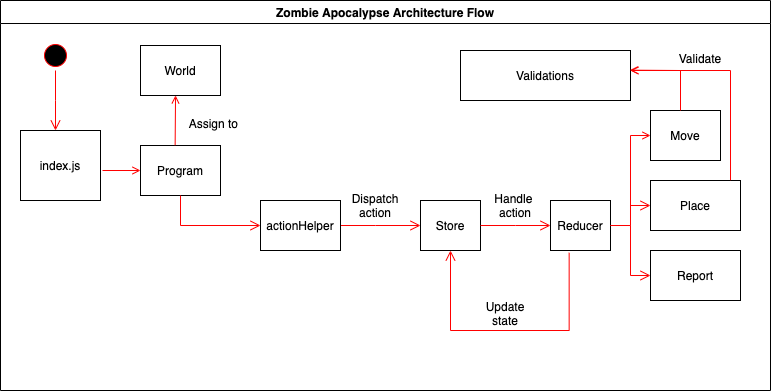

# Zombie Apocalypse

## Contents
- [Description](#description)
- [Technology Stack](#technology-stack)
- [Get Started](#get-started)
- [Design and Architecture](#design-and-architecture)
- [Conclusion](#conclusion)

## Description
Zombie Apocalypse is a program that takes in commands from ther terminal. It walks around the world and infects creatures, whom will become zombies if touched.

At the beginning of the program, a single zombie awakes and begins to move around thegrid following a sequence of movements. Valid movements are Up, Down, Left, Right. The movement sequence is represented by a string of single character movements, e.g. RDRU
(Right, Down, Right, Up). Zombies can move through the edge of the grid, appearing on the directly opposite side. 

As a zombie moves, if it ends up on the same square as a creature, the creature is transformed into another zombie. The creatures are aware of the zombie’s presence but are so frightened that they never move.

Once a zombie has completed its movement, the first newly created zombie moves using the same sequence as the original zombie,then the second newly created zombie moves, and so on, in order of infection. Each zombie performs the same sequence of moves. Once all zombies have completed moving, the final positions of all zombies and creatures should be output, then the program ends.

Example input:
- 4
- (3,1)
- (0,1)(1,2)(1,1)
- RDRU

Example output:
- zombies’ positions:
- (1,1)(3,1)(3,2)(2,1)
- creatures’ positions:
- none

## Technology Stack
- Javascript
- Redux
- Mocha / Chai

## Get Started
Note: Please make sure to have node.js installed.

1. Navigate to the root directory and run:
> npm install

2. Now run the application with:
> npm start

3. You can run the test suite by:
> npm test

## Design and Architecture
- I have developed this program using an OOP approach, where ES6 classes are used to preserve encapsulation. Redux was used to manage the state of the zombie and creatures's positions on the world grid. By using the store and action reducers, we are able to execute the appropriate commands in Redux. I also used Redux to store a zombiesToProcess list, which are the list of zombies which need to perform the sequence of movements. Once the zombie has completed it's movements, I add them to the zombies list. While the zombie is moving, if it finds any creatures, the logic will remove the creature from the creatures list and add it to the zombiesToProcess list, which will then need to process the sequence of movements as mentioned. In order to preserve the LIFO order, I pop off the most recently infected/added zombie from the zombiesToProcess list, to process the sequence of movements. Also, the Redux stores the zombiesCount and creaturesCount, which is used to set the ID of each zombie and creature that during storing into our zombies and creatures lists.

- In terms of the program execution flow, the program first gets initialized. Afterwards, the world gets initialized. Once the user inputs from terminal, it gets parsed and then invokes the actionHelper to dispatch the appropriate action to the redux store. The validation functions are used to validate the input data and throw appropriate error messages. The redux store will then call the reducer with the appropriate dispatched command to be executed. Once the command is executed, the state will be mutated and saved (thanks to ImmerJS). In our case, this means the zombies' positions on the world will be updated after successfully execution.

